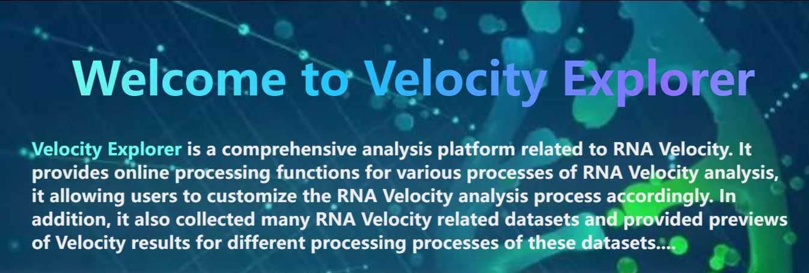

# VelocityExplorer - A comprehensive analysis platform related to RNA Velocity

The official website of VelocityExplorer is [https://VelocityExplorer.com](https://VelocityExplorer.com). It provides online processing functions for various processes of RNA Velocity analysis, it allowing users to customize the RNA Velocity analysis process accordingly. In addition, it also collected many RNA Velocity related datasets and provided previews of Velocity results for different processing processes of these datasets


## Docker

We provide a Docker image to simplify the installation and deployment process of the environment

```bash
docker pull velocityexplorer/velocityexplorer:latest
```

## Installation

### Using GPU

VelocityExplorer includes various RNA Velocity methods, some of which are based on Pytorch or TensorFlow, Please make sure Pytorch, TensorFlow 2 and relative CUDA dependencies are correctly installed.Use the following scripts to confirm Pytorch and TensorFlow is using the GPU.

```python3
import torch
import tensorflow as tf
print ("Torch Cuda is Available: ", torch.cuda.is_available())
print ("Tensorflow Num GPUs Available: ", len(tf.config.list_physical_devices('GPU')))
```

In addition, for GPU acceleration, please install a proper dgl gpu version compatible with your CUDA environment.

```bash
pip uninstall dgl # remove the cpu version
# replace cu101 with your desired CUDA version and run the following
pip install "dgl-cu113>=0.4.3,!=0.8.0.post1"
```

### Conda Environment

Create a separate conda environment for version control and to avoid potential conflicts.

```bash
conda create -n velocity_explorer python=3.7.5
conda activate velocity_explorer
pip install scvelo
pip install django==3.2.10
pip install django-cors-headers
```

To avoid potential conflicts, create an independent conda environment for each RNA Velocity method.

```bash
conda create -n stochastic python=3.7.5
conda activate stochastic
pip install scvelo
```

```bash
conda create -n deterministic python=3.7.5
conda activate deterministic
pip install scvelo
```

```bash
conda create -n dynamical python=3.7.5
conda activate dynamical
pip install scvelo
```

```bash
conda create -n Dynamo python=3.7.5
conda activate Dynamo
pip install dynamo-release
```

```bash
conda create -n DeepVelo python=3.7.5
conda activate DeepVelo
pip install deepvelo==0.2.5rc1
```

```bash
conda create -n UnitVelo python=3.7.5
conda activate UnitVelo
pip install unitvelo
```


```bash
conda create -n VeloAE python=3.7.5
conda activate VeloAE
pip install torch-scatter -f https://data.pyg.org/whl/torch-1.11.0+cu113.html
pip install torch-sparse -f https://data.pyg.org/whl/torch-1.11.0+cu113.html
pip install torch-geometric
pip install git+https://github.com/qiaochen/VeloAE
```

```bash
conda create -n cellDancer python=3.7.6
conda activate cellDancer
pip install celldancer
```

### Usage

Download the project file, enter the project directory, and run the project using the following command.
```bash
conda activate velocity_explorer
python manage.py runserver
```
